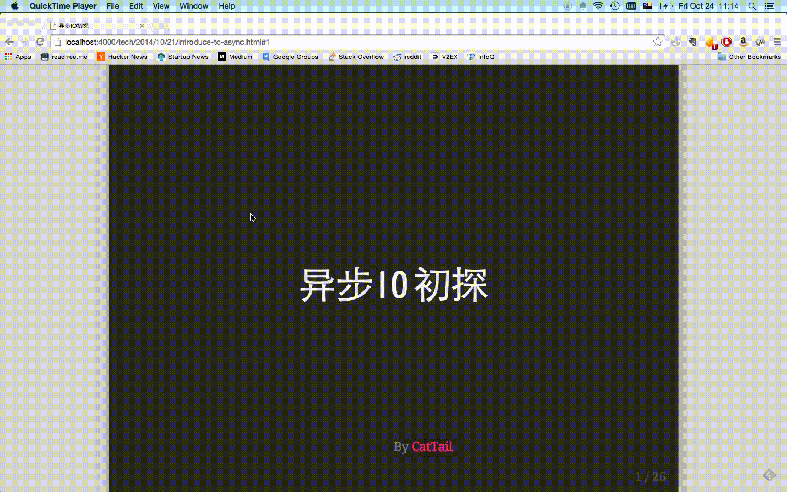
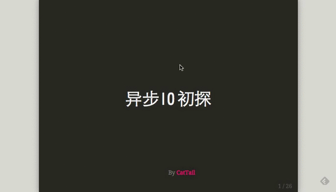

# presenter

> Dead simple slide remote control & synchronization

[Live Demo](bower_components/presenter/dist/presenter.min.js)

## Installation

    bower install presenter

Include `bower_components/presenter/dist/presenter.min.js` at the end of your slides.

Or directly download [presenter.min.js](https://raw.githubusercontent.com/CatTail/presenter/master/dist/presenter.min.js).

## Usage

In the scenery of slide remote control, follow instruction:

1. open slide in laptop which will be controlled, double tap to activate `subscrib mode` 
2. double click slide after a long mousedown, there will be a qrcode show up.  
3. use your smartphone to scan the qrcode and jump to the exactly same web page.
4. tap three times to activate `publish mode`. (here we use a laptop to demostrate how to activate publish mode) 

Now, play your slide in smartphone will be broadcast to all the subscribers.

## How it works

Publisher slide index will be broadcast using [firebase](https://www.firebase.com/) to notify the change of all the subscribers.

## Limit

`presenter` only works with slide **written in html** and use **hash tag** to represent slide index, for example, [remark](https://github.com/gnab/remark).

## License

MIT
