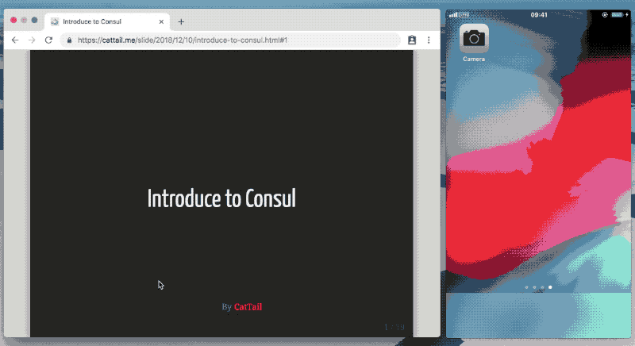

# presenter

> Dead simple slide remote control & synchronization

[Live Demo](https://cattail.me/slide/2018/12/10/introduce-to-consul.html#1)

## Installation

Include presenter.min.js from CDN

    

Or download it from https://raw.githubusercontent.com/CatTail/presenter/master/dist/presenter.min.js

## Usage

1. Open slide in laptop that will be controlled, press `q` to display qrcode.
2. Scan qrcode with mobile, open link in mobile browser.
3. Tap 6 times in mobile browser to enable publish mode.
4. Now you can control laptop slide with your mobile.

## How it works

Publisher will broadcast current slide index to all subscribers with [WebRTC](https://webrtc.org/).

## Limit

`presenter` only works with slide **written in html** and use **hash tag** to represent slide index, for example, [remark](https://github.com/gnab/remark).

## License

MIT
